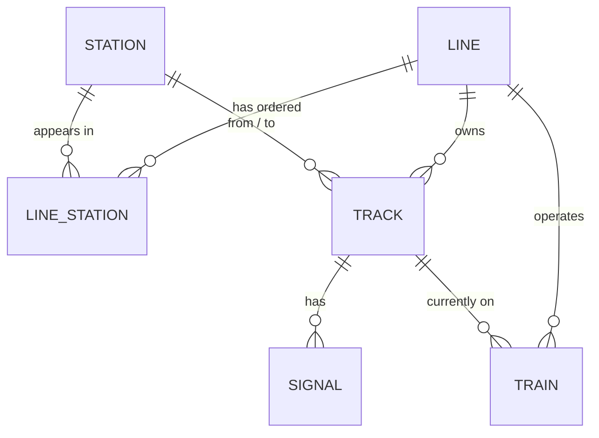

# Domain model

Three separate domain models, one per backend vertical (see `docs/architecture.md`). Backend records
live under `backend/.../domain/model/`; the frontend mirrors what's exposed over each API as
TypeScript interfaces under `frontend/src/domain/`.

## Legacy tick clock (`com.nammametro.simulation.domain.model`, Postgres-backed)

Seven entities — kept for reference; `trainsim` (below) is the actively-developed engine now.

| Entity | Persisted? | Notes |
|---|---|---|
| **Station** | Yes (`stations`) | `code`, `name`, lat/lng, `interchange`, `platformCount`. A station on two lines' `line_stations` rows is an interchange by construction (Majestic, RV Road). |
| **Line** | Yes (`lines` + `line_stations`) | `code`, `name`, `colourHex`, `status`, and an ordered `List<Station>` built from `line_stations.sequence_no`. |
| **Track** | Yes (`tracks`) | Directional segment between two adjacent stations on a line. `UP`/`DOWN` are separate rows, not a single bidirectional edge. |
| **Signal** | Yes (`signals`), not yet queried | One per track, mid-block, seeded `GREEN`. This bounded context's own headway/signalling never landed — `trainsim` implements headway independently against `metro`'s tracks instead (see below). |
| **Train** | Yes (`trains`), currently unused | `code`, `lineId` + `lineCode`, `direction`, `capacity` — a static 2-per-line roster. Was briefly `trainsim`'s roster source; superseded by `LineSchedule` (below) once the engine needed per-train kinematics and scheduled start times, not just a fixed active-from-tick-0 list. Left in place, untouched, same as other superseded-but-kept legacy pieces. |
| **LineSchedule** | Yes (`line_schedules`) | `lineId`+`lineCode`, `direction`, `firstDepartureSeconds`/`lastDepartureSeconds`/`headwaySeconds`/`trainCount` (mutually validated — a DB `CHECK` and `LineScheduleAssembler` both reject a schedule whose numbers disagree), plus the per-train config every train it generates inherits: `dwellTimeSeconds`, `capacity`, `maxSpeedKmph`, `accelerationMps2`, `brakingRateMps2`. One row per `(line, direction)` — see `docs/architecture.md`'s "Scheduling and dispatch". |
| **Passenger** | **No table** — runtime-only | Still not implemented — explicitly deferred again this chunk. A table is only worth adding if passenger history needs to survive a restart. |
| **Simulation** (legacy) | Config persisted (`simulation_config`); live state is in-memory | The original tick-only `Simulation`/`SimulationEngine` pair, independent of and superseded in capability by `trainsim.TrainSimulationEngine` below, but left running at `/api/v1/simulation` for reference. `simulation_config` itself gained four new columns (`start_time`, `base_sim_seconds_per_tick`, `delay_threshold_seconds`, `random_seed`) in V3 — read by `trainsim`, not by this legacy engine. |

## Why some models exist but do nothing yet

`Signal` and `Passenger` are deliberately inert — `Signal` because `trainsim`'s headway model turned
out simpler to build directly against `metro.domain.model.Track` (a one-train-per-block occupancy
check) than to route through this table's per-signal rows; `Passenger` because passenger demand is
explicitly out of scope until a future chunk. `Train`/`trains` is inert for a different reason: not
a placeholder for later, but a superseded design `LineSchedule` replaced — kept rather than deleted
so nothing referencing it breaks, per this project's general "kept for reference" convention for
superseded pieces.

## Discrete-time simulation engine (`com.nammametro.simulation.trainsim.domain.model`, Postgres + graph)

The active train-movement engine. `SimulationState` is the aggregate: a `SimulationClock` plus every
train's `TrainState`. Both are plain immutable records — the engine holds the current one in an
`AtomicReference` and replaces it wholesale each tick (see `docs/architecture.md` for the full tick
pipeline and determinism argument).

| Entity | Notes |
|---|---|
| **SimulationClock** | `startTime` (a fixed `Instant`, never wall-clock `now()`), `status` (reuses the legacy `SimulationStatus` enum), `speed` (`SimulationSpeed`: 0.5/1/2/5/10/50x), `currentTick`, `elapsedSimulationSeconds`. `currentTime()` is `startTime + elapsedSimulationSeconds` — a pure derivation, not a stored value. |
| **TrainState** | `id`, `code`, `lineCode`, `direction`, `currentTrackId` (null unless departing/running/arriving), `previousStationId`/`nextStationId`, `progress` (0→1, never teleports), `speedKmph` (real momentum, not a flat average — see architecture doc), `status` (`TrainStatus`, 9 values starting from `SCHEDULED` — see its Javadoc for the full transition diagram), `passengerCount`, `capacity`, `scheduledDepartureSeconds`/`dwellTimeSeconds`/`maxSpeedKmph`/`accelerationMps2`/`brakingRateMps2` (immutable, inherited from the `LineSchedule` that generated this train), plus two implementation-only fields (`dwellRemainingSeconds`, `heldSeconds` — exposed over the API as `delaySeconds`) the dwell/headway logic needs to be resumable. |
| **EngineSettings** | `baseSimSecondsPerTick`, `minHeadwaySeconds` (reuses `simulation_config.headway_seconds`), `delayThresholdSeconds`, `randomSeed` — loaded once per run, never mutated by the tick loop. |
| **SimulationEvent** | `tick`, `simulationTime`, `type` (`EventType`: `DWELL_STARTED`/`DEPARTED`/`ARRIVED`/`HELD_FOR_HEADWAY`/`DELAYED`/`ROUTE_COMPLETED`), `trainId`, `trainCode`, `stationId`, `message`. Not stored in `SimulationState` — collected per tick and broadcast separately (`/topic/train-simulation/events`), a streaming concern rather than queryable state. |

`TrainRosterAssembler` is the only place that reads external state: `Train`/`SimulationConfig` from
Postgres (via the *existing* `TrainRepository`/`SimulationConfigRepository` out-ports — reused
as-is, not duplicated) and `Line`/`Station` topology from `metro.network.MetroNetwork`. It runs once
at startup and again on every `reset()`, producing a fresh `SimulationState` with every train
`AT_STATION` at the first stop of its configured `direction`.

## Network graph (`com.nammametro.simulation.metro.domain.model`, JSON-dataset-backed)

Station = graph node, Track = graph edge — see `data/README.md` for the dataset these are built from.

| Entity | Notes |
|---|---|
| **Station** | `id`, `code`, `name`, `coordinates`, `lineCodes`, `type`, `dwellTimeSeconds`. `lineCodes` and `type` (`REGULAR`/`INTERCHANGE`/`TERMINAL`) are *derived* at load time from which lines list the station — never authored directly, so they can't drift out of sync with the topology. |
| **Line** | `id`, `code`, `name`, `colorHex`, an ordered `List<Station>` (travel order, terminus to terminus). |
| **Track** | An *undirected* edge: `fromStationId`, `toStationId`, `distanceMetres`, `expectedTravelTimeSeconds`, optional `geometry` (empty in the bundled dataset). One track per adjacent station pair — unlike the simulation model's `Track`, there's no separate `UP`/`DOWN` row, since routing doesn't care about direction. |
| **Interchange** | Not persisted or authored — `MetroNetwork.getInterchanges()` computes it: any station with more than one line code, paired with those lines' full details. |

`MetroNetwork` (in `metro.network`) is the in-memory graph these live in: built once at startup by
`MetroNetworkConfig`/`MetroNetworkAssembler`, queried directly by `MetroController` and
`DijkstraRouteFinder` — no database round-trip per request. `MetroNetwork.validate()` and
`DijkstraRouteFinder` are plain Java with no Spring dependency, exercised directly in
`backend/src/test/java/.../metro/{network,routing}`.
