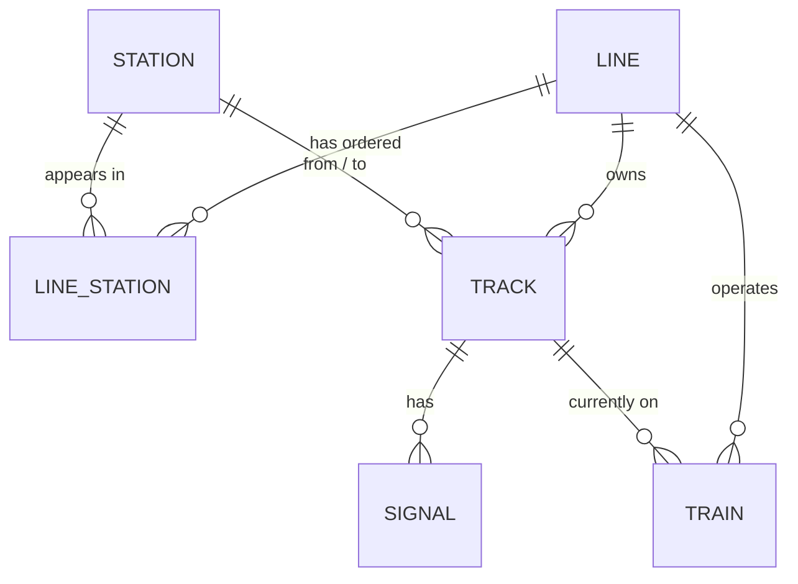

# Domain model

Two separate domain models, one per bounded context (see `docs/architecture.md`). Backend records
live under `backend/.../domain/model/`; the frontend mirrors what's exposed over each API as
TypeScript interfaces under `frontend/src/domain/`.

## Simulation clock (`com.nammametro.simulation.domain.model`, Postgres-backed)

Seven entities.

| Entity | Persisted? | Notes |
|---|---|---|
| **Station** | Yes (`stations`) | `code`, `name`, lat/lng, `interchange`, `platformCount`. A station on two lines' `line_stations` rows is an interchange by construction (Majestic, RV Road). |
| **Line** | Yes (`lines` + `line_stations`) | `code`, `name`, `colourHex`, `status`, and an ordered `List<Station>` built from `line_stations.sequence_no`. |
| **Track** | Yes (`tracks`) | Directional segment between two adjacent stations on a line. `UP`/`DOWN` are separate rows, not a single bidirectional edge. |
| **Signal** | Yes (`signals`), not yet queried | One per track, mid-block, seeded `GREEN`. No REST endpoint or out-port yet — nothing consumes it until signalling logic exists. |
| **Train** | Yes (`trains`), not yet queried | Two per line, `IDLE`, no `currentTrackId`. Persistence layer exists (repository + adapter); no REST endpoint yet since nothing displays them this chunk. |
| **Passenger** | **No table** — runtime-only | Generated and consumed entirely in memory once passenger simulation exists. A table is only worth adding if passenger history needs to survive a restart. |
| **Simulation** | Config persisted (`simulation_config`); live state is in-memory | `Simulation` is an immutable record — `status`, `currentTick`, `elapsedSimulationTime`, `config`. `SimulationEngine` holds the current one in an `AtomicReference` and replaces it each tick; it is not written back to the database. |

## Why some models exist but do nothing yet

`Train`, `Signal`, and `Passenger` are deliberately inert this chunk — the fields a future feature
will obviously need, and nothing more. `TickHandler` (`application/service/TickHandler.java`) is the
extension seam: a future "train movement" feature adds a `TickHandler` implementation that reads and
advances train positions each tick; it does not need to change `SimulationEngine`, the REST
controllers, or the WebSocket wiring.

## Network graph (`com.nammametro.simulation.metro.domain.model`, JSON-dataset-backed)

Station = graph node, Track = graph edge — see `data/README.md` for the dataset these are built from.

| Entity | Notes |
|---|---|
| **Station** | `id`, `code`, `name`, `coordinates`, `lineCodes`, `type`, `dwellTimeSeconds`. `lineCodes` and `type` (`REGULAR`/`INTERCHANGE`/`TERMINAL`) are *derived* at load time from which lines list the station — never authored directly, so they can't drift out of sync with the topology. |
| **Line** | `id`, `code`, `name`, `colorHex`, an ordered `List<Station>` (travel order, terminus to terminus). |
| **Track** | An *undirected* edge: `fromStationId`, `toStationId`, `distanceMetres`, `expectedTravelTimeSeconds`, optional `geometry` (empty in the bundled dataset). One track per adjacent station pair — unlike the simulation model's `Track`, there's no separate `UP`/`DOWN` row, since routing doesn't care about direction. |
| **Interchange** | Not persisted or authored — `MetroNetwork.getInterchanges()` computes it: any station with more than one line code, paired with those lines' full details. |

`MetroNetwork` (in `metro.network`) is the in-memory graph these live in: built once at startup by
`MetroNetworkConfig`/`MetroNetworkAssembler`, queried directly by `MetroController` and
`DijkstraRouteFinder` — no database round-trip per request. `MetroNetwork.validate()` and
`DijkstraRouteFinder` are plain Java with no Spring dependency, exercised directly in
`backend/src/test/java/.../metro/{network,routing}`.
